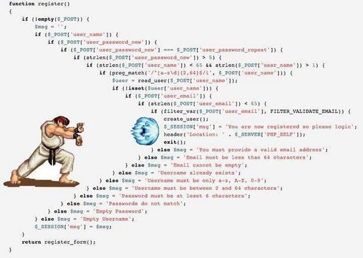

# StreetFighter - better error handling for Ruby

This library helps to avoid the code smell of "cascading conditionals" (otherwise known as the StreetFighter anti-pattern) by using providing an "Either" data type and interface to your program.



## Example

In the game Street Fighter, the hero, Ryu, must defeat 10 opponents. We'll just list three for demonstration:

* Retsu (Japan), who has powers including the flying kick and sweep
* Geki (Japan), who throws ninja stars and is able to teleport
* Joe (USA), who can do a power kick and low kick

Source: [Strategy Wiki](http://strategywiki.org/wiki/Street_Fighter/Opponents)

Let's say that Ryu must fight the three opponents above in sequence. He continues battling until he is defeated or he defeats all three opponents. As the game programmer, you must either return a structure representing Ryu, unscathed at the end of the fights, or you must return the opponent who defeated Ryu.

A first attempt at modeling this problem may look as follows. We assume there is a function called `battle` that returns the winner of a particular fight. Note the "Street Fighter anti-pattern":

```ruby
def fight
  if ryu == battle(ryu, retsu)
    if ryu == battle(ryu, geki)
      if ryu == battle(ryu, joe)
        ryu
      else
        joe
      end
    else
      geku
    end
  else
    retsu
  end
end
```

It's hard to read, let alone verify that this logic is consistent with the game requirements. Let's try it using the StreetFighter gem. First, we'll create a structure to represent the players. For now, a simple Struct with a name and a boolean representing whether they're the hero or opponent will suffice:

```ruby
Player = Struct.new(:name, true)
```

Let's define the hero and three opponents:

```ruby
retsu = Player.new(:retsu, false)
geki  = Player.new(:geki,  false)
joe   = Player.new(:joe,   false)
```

And the fighting function:

```ruby
# Perform a random battle, giving the hero 3 chances to win to every
# 1 chance for the opponent. We must return the winner wrapped in a `Left`
# if the winner is the opponent, or a `Right` if the winner is our hero.
def battle(opponent, hero)
  winner = ([hero] * 3 << opponent).sample
  winner.hero ? StreetFighter::Right.new(winner) :
                StreetFighter::Left.new(winner)
end
```

Finally we define the rounds of the game. We're going to use [currying](http://en.wikipedia.org/wiki/Currying) here
so that we can apply an opponent to each battle, and wind up with a partially-
applied function. Essentially, each partially-applied function can be thought of as an opponent angrily waiting until he has the opportunity to try to do serious damage to our hero, Ryu.

```ruby
fight = method(:battle).to_proc.curry
```

I hope you're ready - the fight is about to begin!

```ruby
# Note that we have to wrap our fighter in a *Right* value to indicate
# that he's the hero before he engages in his series of fights.
winner = StreetFighter::Right.new(hero).
           failable( fight[retsu], fight[geki], fight[joe] )

case winner
when StreetFighter::Left
  puts "Our hero has been defeated, and #{winner.value.name} is the new champion."
when StreetFighter::Right
  puts "Ryu has defeated his opponents!"
end
```

Fortunately, the output is:

    Ryu has defeated his opponents!

Not only has Ryu won this round, but we've completely defeated the cascading conditionals by applying some easy-to-use functional patterns. If you'd like to play around with the game and see if Ryu keeps up his winning streak, [it's a part of the test suite for this library](spec/street_fighter/street_fighter_game_spec.rb).

## Credits

Thanks to [Paul Dragoonis](https://twitter.com/dr4goonis) for [identifying
this anti-pattern and giving us a great graphical illustration of the beast in the wild](https://twitter.com/dr4goonis/status/476617165463105536).
